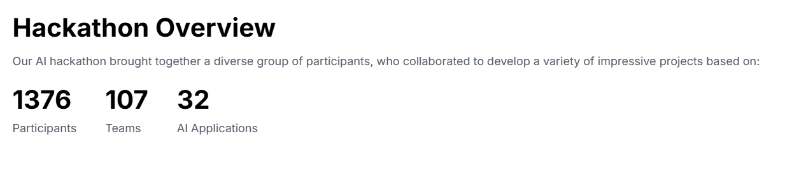
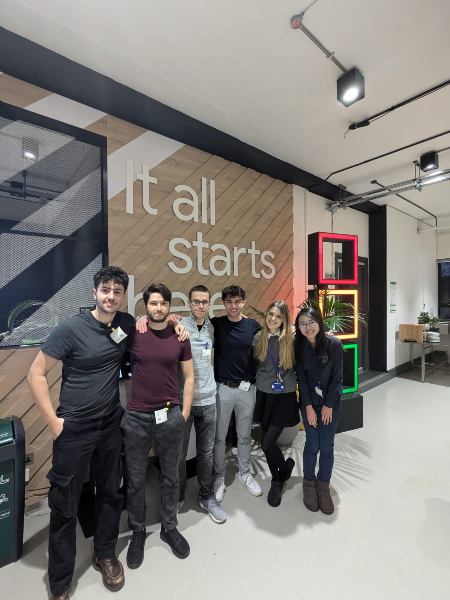

# Google Gemma 2 AI Hackathon

## TLDR:
- Developed a purely voice-based Gmail app for visually impaired individuals
- Evaluated with 18/20 points by @Gus Martins (Product Manager @Google)
- Features include: Text-to-Voice Email Reading, Voice-to-Text Email Dictation, AI-powered Email Draft Suggestions and Email Summarization (LLM – Gemma 2)
=> Technologies Used: Python, Streamlit, PyTorch, Transformers, Gmail API, Google API (OAuth 2.0)

## Full Description
We sent one of our teams from the QMML Society to the Google Gemma 2 AI Hackathon where over 1350 participants applied but only 60 were invited to the Google office in London for in-person talks and workshops. Our team of 6 were all among the 60 invited.

Over the course of 4 days our team developed InSightMail, which is thoughtfully crafted to enhance accessibility, enabling individuals who are blind to seamlessly manage and communicate through their Gmail inbox. Leveraging the advanced Gemma 2 model, InSightMail transforms email interaction into an intuitive and natural language experience.

### **Key Features:**
- Email Summarization: Quickly grasp the essence of your messages with concise and clear summaries.
- Smart Email Responses: Effortlessly reply to emails using intelligent, context-aware suggestions.
- AI-Powered Email Drafting: Compose well-articulated emails with the assistance of our sophisticated AI drafting tool.
- Experience a more accessible and efficient way to stay connected with InSightMail—where technology meets inclusivity.

### Our teams' AI system is available as an [open-source repository](https://github.com/KarlLearnsAI/InSightMail)

### We had a great time and thanks to the Google Gemma team for this great opportunity!

## Team Members: Stanisław Marć, Manuel Teres, Peng Yeh, Maxim Khovansky, Mariia Zimokha, Karl Johannes